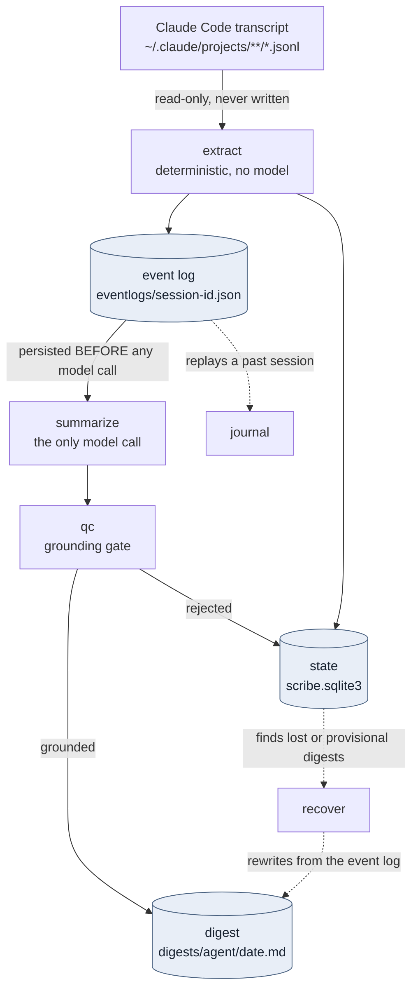

# scribe

[](https://claude.ai/code)
[](https://github.com/TadMSTR/scribe/actions/workflows/ci.yml)
[](https://www.python.org/downloads/)
[](https://opensource.org/licenses/MIT)

**A deterministic extractor that turns a Claude Code transcript into a structured event log, so session summaries stop being guesswork.**

Summarizing a coding session is normally set up as: hand a model the conversation text and ask it what happened. That fails for a reason that has nothing to do with the model. The conversation text is a small and unrepresentative fraction of the session — the tool calls, the commands, the file edits and their results are all in the transcript, and none of them are in the text.

Scribe extracts them first.

---

## The measurement that motivated this

Claude Code writes each session to a JSONL transcript. The pipeline scribe replaces parsed those transcripts by keeping user text and assistant text and skipping everything else. Measured against one real 2.5 MB session:

| Block type | Count | Characters | Fate under the old parser |
|---|---:|---:|---|
| user text | 12 | 1,733 | kept |
| assistant text | 35 | 32,262 | kept |
| `tool_use` | 176 | 227,893 | **dropped** |
| `tool_result` | 176 | 261,658 | **dropped** |
| `thinking` | 96 | — | dropped |

**33,995 of 523,546 characters — 6.5% — reached the summarizer.** The prompt then asked that model to "mention file names, function names, tool names, and concrete outcomes": a category of fact that had been removed from its input. A capable model degrades to filler under that instruction; a smaller one invents plausible file paths. Both look like a model-quality problem, and neither is.

Running scribe over the same session captures all 176 tool events.

## Why not just stop dropping the tool blocks

Three reasons, and the extractor addresses all three at once:

| Problem with raw tool bodies | What scribe does |
|---|---|
| **Cost.** Full-fidelity tool traffic runs roughly $26/month against a $30 allowance. | Compresses each call to a name, a bounded argument digest, exit status and the path or command it touched. |
| **Secrets.** Raw `tool_result` bodies carry `docker inspect` env blocks and `Bearer` headers verbatim into a file that then gets indexed. Measured across 429 real transcripts: **8,015 secret-shaped values in 324 of them (76%)**. | Redacts at extraction time, and reports a count so you can tell "found nothing" from "did not run". |
| **Granularity.** Per-turn summarization cannot express a cross-turn finding, because the summarizer never sees two turns at once. | Emits the whole session as one document. |

## What it produces

```bash
python -m scribe.extract path/to/transcript.jsonl --json | jq '.stats'
```

```json
{
  "turns": 12,
  "tool_events": 176,
  "tool_results": 176,
  "failures": 4,
  "raw_content_chars": 642858,
  "extracted_chars": 194667,
  "compression_ratio": 0.3032,
  "token_estimate": 48667,
  "secrets_redacted": 45,
  "degradation_level": 1,
  "budget_exceeded": false
}
```

The document is a list of turns. Each turn carries the user's message, the assistant's replies, every tool call as an event, and a **rollup** — files read, files written, commands run, MCP tools called, failures, tickets, PRs and git refs, all derived in code rather than inferred by a model:

```json
{
  "turn_uuid": "9f2c1e4a-…",
  "user_text": "Check the release workflow",
  "events": [
    {"seq": 0, "tool": "Bash", "kind": "bash",
     "target": "gh run list --workflow release.yml", "ok": true,
     "result_digest": "completed  success  v0.5.1  …"}
  ],
  "rollup": {
    "commands": ["gh run list --workflow release.yml"],
    "files_written": ["/repo/CHANGELOG.md"],
    "tickets": ["#843"],
    "prs": ["TadMSTR/scribe#1"]
  }
}
```

That rollup is what makes a summary checkable. A digest claiming a file was edited can be tested against `files_written` — deterministically, with no second model involved.

Without `--json` you get a readable rendering of the same thing.

## Install

```bash
git clone https://github.com/TadMSTR/scribe.git && cd scribe
python -m venv .venv && .venv/bin/pip install -e ".[dev]"
.venv/bin/python -m scribe.extract ~/.claude/projects/*/SESSION.jsonl
```

The extractor has **no runtime dependencies** and makes no network calls. That is deliberate and worth keeping: it is the one component that reads raw transcripts, which are the least trustworthy input in the system.

## Design commitments

**Read-only on transcripts.** Scribe never writes to `~/.claude/projects/*/*.jsonl`. Those are the only durable record of what happened, and Claude Code already expires them after 30 days. The test suite asserts this on both content and mtime rather than trusting code review.

**Redaction is counted, not just applied.** `secrets_redacted` is a number. "No secret appears in the output" is also true of an extractor that produced nothing, so absence alone proves nothing — the count is what shows the filter ran.

**Redact before truncating.** A digest is a truncation, and truncating first can cut a token in half and leave the leading half. A shorter fragment of a credential is not a safer one.

**Tool identity is never discarded.** When a session exceeds the byte budget, scribe drops result digests first, then argument digests, then *tightens* targets — never removing them. A Bash event's target is its command line, the single most valuable fact in the log. If even the floor exceeds the budget, it says so via `budget_exceeded` rather than shipping a stripped log that looks like a quiet session.

Measured across 429 real transcripts at the default 200,000-character budget: 74% need no degradation at all, the busiest reaches the bottom of the ladder, and 5 exceed the budget on user and assistant text alone.

## Options

| Flag | Default | Meaning |
|---|---|---|
| `--json` | off | Emit the event log as JSON instead of a readable digest |
| `--indent N` | compact | Pretty-print the JSON |
| `--max-chars N` | `200000` | Byte budget before degradation; `0` disables it |

Exit codes: `0` success (including an empty session, which is a real outcome), `2` the transcript could not be read.

## Architecture

Seven components: extract, summarize, writeback, qc, journal, recover, state.

The ordering that matters most is the one in the middle — **the event log is written to disk
before the model is called, not after.** Everything scribe knows about a session is already
persisted by the time anything can fail, so a crashed or rate-limited run still leaves complete
evidence behind. A pipeline that summarized first and persisted second would lose the session
and the record of it together.



Two consequences of that shape are worth naming, because they are what the design buys:

- `recover` can rebuild a digest without the transcript, because the event log is the input to
  summarization rather than a by-product of it.
- `extract` is the only component that reads a transcript, and it never writes to one. That is
  asserted in the test suite against both content and mtime, not just documented here.

## The rest of the pipeline

```bash
python -m scribe run                 # dry run: discover, extract, check. No network.
python -m scribe run --live          # live run: also summarize and write
python -m scribe events SESSION_ID   # print the event log behind a digest
python -m scribe qc --digest D --events E   # exits non-zero on an ungrounded digest
python -m scribe journal             # SessionStart hook payload for this agent
python -m scribe recover             # report sessions whose digest was never written
python -m scribe recover --apply     # reopen them, so the next run redoes them
python -m scribe index --rebuild     # regenerate index.jsonl from the digests on disk
python -m scribe index --check       # exits non-zero if index.jsonl has drifted
```

**`run` defaults to a dry run.** It discovers finished sessions, extracts them and reports —
without constructing a provider, reading a credential or calling anything. The mode that
spends money and sends data off the machine has to be asked for by name.

**A dry run may observe; it must not process.** It writes no digest and no event log, and it
does not advance a session's read offset or mark it summarized, so the live run that follows
still has everything to do (vikunja#902). What it *does* write is discovery's own record of
what is on disk — a transcript's size and mtime — because an observation says what was seen,
not what was handled (invariant 8). Measured on the live corpus, one sweep touches ~460 such
rows. That is the pass doing its job, not a leak in the guarantee: `scribe run` earlier said
it wrote *nothing*, which was never true of discovery and is the claim #902 corrected.

A session is finished once its transcript has been idle past a quiet period, because the Stop
hook fires per *turn* and there is no session-end signal. That inference can be wrong in one
direction — Claude Code appends to an existing transcript when a session resumes — so state
records how far the file was *read*, and growth past that offset makes a session live again
regardless of its status.

### Three tiers, and how to get between them

What scribe keeps is layered by cost, and each layer is reachable from the one above it:

| Tier | Where | Size per session | Indexed |
|---|---|---|---|
| **Digest** — what happened | `~/.local/share/scribe/digests/<agent>/<date>.md` | ~2 KB | yes — by whatever indexer you point at it (forge uses qmd) |
| **Event log** — the evidence | `~/.local/share/scribe/eventlogs/<session-id>.json` | ~190 KB | **no** |
| **Raw transcript** — everything | `~/.claude/projects/*/*.jsonl`, and Backrest | ~2.5 MB | no |

The middle tier is the one that makes a digest checkable after the fact. It is written
**before** the summarization call, so a run whose model call failed still leaves a complete
record of what it saw — which is the case you most want it for — and a replay can skip
re-extraction.

Going from a digest line to its evidence is a lookup, not a search. Every block carries its
session id in the anchor comment above it:

```bash
sed -n 's/.*session:\([^ ]*\).*/\1/p' ~/.local/share/scribe/digests/research/2026-09-15.md
python -m scribe events "$SESSION_ID" | jq '.turns[].rollup'
python -m scribe qc --digest "$DIGEST" --events "$(python -m scribe events "$SESSION_ID" --path)"
```

**Event logs are deliberately not indexed**, and live in a sibling directory rather than
under `digests/` so that stays true by construction. They are evidence reached *from* a
digest, not a search target; indexing ~39 MB of tool arguments would swamp the digest signal
in every semantic query. They are also the least redacted thing scribe keeps, so they are
written `0600` inside a `0700` directory, like everything else derived from a transcript.

Retention is settled: **keep everything.** The measured corpus is 429 sessions in ~39 MB,
growing at roughly 0.46 GB/year. There is no pruning and none is planned.

### Using a different indexer

scribe does not depend on any indexer. It writes plain markdown and leaves indexing to
whatever you run: forge happens to use qmd, whose `session-digests` collection globs
`<output_dir>/**/*.md`, but there is no qmd code in scribe. Whichever indexer you use, it
has two rules to follow:

1. **Index `output_dir`.** Every digest is a `.md` file under it, at `<agent>/<date>.md`.
2. **Never index `eventlog_dir`.** Those files are evidence you look up from a digest, not
   something to search. They are large, less redacted, and would drown out the digests in
   every query. The directory sits next to `output_dir`, not inside it, so a glob over
   `output_dir` can't pick them up by accident.

A **pull** indexer (one that globs a directory) needs nothing else. A **push** indexer, which
has to be told what changed (a vector DB, Meilisearch, OpenSearch behind an API), gets
two more things to work with:

**`index.jsonl`, an append-only manifest.** scribe appends one line each time it writes a
block:

```json
{"path": "research/2026-09-23.md", "sha256": "…", "agent": "research", "date": "2026-09-23",
 "session_id": "…", "turn_uuid": "…", "provisional": "", "eventlog_path": "….json",
 "written_at": "2026-09-23T19:40:02+00:00"}
```

| field | meaning |
|---|---|
| `path` | the digest file, **relative to `output_dir`** |
| `sha256` | hash of **this block** (anchor line through closing marker), not of the file |
| `agent`, `date` | the directory and the day the digest was filed under |
| `session_id`, `turn_uuid` | the block's identity, as written in its anchor |
| `provisional` | `""` for a real digest, `"placeholder"` or `"suppressed"` for a stand-in (see [When a digest is not written](#when-a-digest-is-not-written)) |
| `eventlog_path` | the event log, relative to `eventlog_dir`; `""` if there is none |
| `written_at` | when the line was appended; `null` on a rebuilt line. Informational only, never checked |

By default it lives next to `output_dir`, at `<output_dir>/../index.jsonl`, and is created
`0600`. Put it somewhere else with `[index] manifest_path`. scribe refuses to load a
config that puts it inside `output_dir` or `eventlog_dir`.

**Digests are not write-once, so a consumer needs two rules:**

- **Each record is identified by `(path, turn_uuid)`, and the last line for that pair
  wins.** A stand-in block is replaced in place when its real digest arrives. That keeps
  the same `turn_uuid` and produces a second line with a new `sha256`.
- **Index whole files.** Any number of sessions share one daily file, so the same `path`
  shows up again with different `turn_uuid`s. Whenever a line names a `path`, re-ingest
  that whole file; don't try to rebuild it from the block records.

If you only want real digests, filter on `provisional == ""`.

The manifest is **derived state**. Every field except `written_at` can be recomputed from the
digests themselves. `scribe index --rebuild` regenerates it from the files, which is how
digests written before the manifest existed get added to it. `scribe index --check` does the
same rebuild in memory and exits `1` on any missing, stale, changed or malformed line, so a
manifest that has drifted from the digests gets caught. Run `--rebuild` when no sweep
is in progress. A line appended during the rebuild can be lost, and `--check` will then
report it as missing.

**`[index] on_digest_written`, an optional notification.** An argv list, run once for each
block written, after its manifest line is in place, with the digest's absolute path
appended as the last argument:

```toml
[index]
on_digest_written = ["/usr/local/bin/my-indexer", "--file"]
on_digest_written_timeout_seconds = 30   # default; a guess, not a measurement
```

It is run without a shell and with stdin closed, and it does **not** inherit scribe's
environment. That environment holds the summarizer's API key, which an indexer has no use
for. The hook gets `PATH`, `HOME`, `USER`, `LOGNAME`, `LANG`, `LC_ALL`, `LC_CTYPE`, `TZ` and
`TMPDIR`, plus any variables you list by exact name in `on_digest_written_env` (for example
the indexer's own token). It gets a timeout, and a hook still
running at the deadline is killed along with its child processes. **A string value is
rejected when the config loads:** the path appended to the command is built from an
agent name that comes from outside scribe, so passing a string through a shell would open a
command-injection hole. Hook failures never affect the run. They are counted
(`on_digest_written: N ok, M failed` in the run output, `hook_ok` / `hook_failed` in
`--json`) and never change whether a digest was written.

**`[discovery] emit_frontmatter = true`, optional YAML frontmatter.** Off by default. When
on, each daily file starts with `agent`, `date`, `source: scribe` and `session_ids`. The
per-block anchors don't change, and the journal preview reads the file exactly as before;
a test runs the reference parser over both forms to prove it.

The `<agent>/` partition comes from the transcript's project directory. It isn't configurable
yet.

### Feeding the SessionStart injection

Digests are also **pushed**, not only retrieved. `python -m scribe journal` emits the JSON a
Claude Code `SessionStart` hook writes to stdout, built from this agent's two most recent
digests:

```bash
CLAUDE_PROJECT_DIR=~/.claude/projects/sysadmin python -m scribe journal | jq -r \
  '.hookSpecificOutput.additionalContext'
```

`hooks/session-start.sh` is the wrapper to register. Point `SCRIBE_PYTHON` at an interpreter
that can import scribe:

```json
"hooks": { "SessionStart": [ { "matcher": "", "hooks": [
  { "type": "command", "command": "/path/to/scribe/hooks/session-start.sh" } ] } ] }
```

**`hookSpecificOutput.additionalContext` is the field that carries content.** A hook emitting
a bare `systemMessage` is dropped for agent sessions, so the status line this also emits is an
operator signal in a terminal, not a delivery mechanism. That asymmetry was measured, not
assumed, and it is why the payload is shaped the way it is.

This replaces an injection that read a journal written by a component being retired. The
format needed no porting — the incumbent's parser, run over a real scribe digest, produced 177
lines of clean output unmodified — so what moved is the directory and what is asserted is
agreement: `tests/reference/recent_memory_preview.awk` holds that parser verbatim and
`tests/test_journal.py` requires byte-for-byte equality with it. The point is to fail the day
the digest format drifts, which is the day a `SessionStart` hook would otherwise start
injecting an empty block and say nothing about it.

Absence is reported rather than inferred. "scribe has not run yet" and "scribe is writing
somewhere else" produce the same empty injection and are distinguished only by the status
line, which names the directory it looked in.

### When a digest is not written

Not every run produces a digest. Two outcomes write a block that is *not* a summary, and both
are marked as such in the block's own anchor:

| body | anchor | meaning |
|---|---|---|
| a digest | no `provisional:` attribute | final; never overwritten |
| `render_failure` placeholder | `provisional:placeholder` | the model call or the schema failed |
| suppression note | `provisional:suppressed` | the contamination guard fired |

A provisional block is **replaced in place** by the first real digest that arrives for the
same turn, and its session is offered again for a bounded number of sweeps
(`state.MAX_PROVISIONAL_ATTEMPTS`). A final block is never overwritten by anything, including
by a later placeholder for the same turn.

### Why a long field does not become a placeholder

A schema violation produces a placeholder, so what counts as a violation decides what gets
lost. Two things can be wrong with a response, and only one of them is worth discarding a
session over:

| class | fields | over the cap means | so |
|---|---|---|---|
| **bounded** | `done`, `artifacts`, `tickets` | the model invented entries — the log cannot support that many | reject, not retryable |
| **unbounded** | `found`, `decisions`, `open_items` | the model went long — free prose, nothing bounds it | truncate, mark, and write |

Any cap on free prose is an arbitrary cliff, so rejecting at one trades a whole session for a
surplus bullet. The cap is still **declared** to the model in the JSON schema — that is what
makes it shed to fit, and truncation is only the backstop for when shedding is not enough.

This distinction is the one thing to preserve here. It was diagnosed three times as "the cap
is too low" (#849, #872, #884) and fixed three times by raising a number, which relocates the
cliff rather than removing it. Do not read the written corpus as evidence a cap is safe: it is
right-censored by that very cap, so the survivors top out below it no matter where it is set.

#### Where a bounded cap comes from

A fourth raise would have decayed on the same schedule: `tickets` was set above an observed
ceiling of 76 and 38 event logs later the ceiling was 104, which cost a faithful digest
(vikunja#901). So the bounded caps are no longer chosen from a corpus snapshot at all — each
is derived from **that session's own event log**, which is known before the model is called:

| field | denominator | headroom | floor |
|---|---|---|---|
| `done` | `stats.tool_events` | 0.5x | 200 |
| `tickets` | `rollup.tickets` | 1.5x | 100 |
| `artifacts` | `files_written` ∪ `prs` ∪ `git_refs` | 2.0x | 100 |

`min(max(ceil(denominator x headroom), floor), floor x 10)`, so the old global becomes a floor
and the cap only ever moves up: no session is rejected that would not be rejected today, and 99% of sessions are
unaffected. The headroom is per field and the gap above the denominator is deliberate — since
the cap is *declared*, one set near the ceiling does not reject, it makes the model shed by a
different amount each run.

The outer clamp is **not** a measured number, unlike everything else here. The denominators
come from a file on disk, so without a ceiling a doctored event log removes the `bounded`
invention guard outright rather than merely widening it. At 10x it can be widened and no more.
It is inert today: the largest derived cap in the corpus is `done` 336 against a ceiling of
2000, so no log comes within 6x of it. Do not tune it towards the corpus.

`done` takes the smallest multiplier because its ratio falls as sessions grow: the largest log
in the corpus has 672 tool events and wrote 37 `done` items. `artifacts` takes the largest
because its denominator undercounts by construction — the prompt asks for *services* and there
is no rollup for them.

Re-measure with `python -m scribe cap-survey`, never by reading the digests:

```bash
python -m scribe cap-survey          # input ceilings, floors, and where the derived cap lands
python -m scribe cap-survey --json   # the same, for a script
```

This is what the run totals mean:

```
written == summarized + suppressed + placeholder
```

plus a fourth counter, `discarded`, for a digest that was produced and then *not* written.
That should be unreachable — it is printed so the claim is checkable rather than assumed. It
was not always: before the provisional marker existed, a placeholder occupied its turn uuid,
the retry succeeded, and `append_block` refused the result. 30 sessions were summarized,
paid for and discarded, and every run reported them as clean (vikunja#872, #868).

`scribe recover` reopens sessions whose blocks predate the marker. It identifies them by
body rather than by anchor — which is exactly why they were unrecoverable — stamps the
anchors, and clears the state so the next run redoes them. Dry by default and idempotent:

```bash
python -m scribe recover              # what would change
python -m scribe recover --apply      # change it
python -m scribe run --live           # then re-summarize
```

It joins on `transcript_path`. A session whose transcript has been deleted is reopened from
its **event log** instead: `load_eventlog` reads the persisted log back into the same
`EventLog` the extractor would have produced, so a digest survives its source (vikunja#873).
Transcripts age out at 30 days while `eventlogs/` has no cleanup policy, so the log is the
durable copy. Only a session `recover` reopens is ever replayed — an orphaned log whose digest
is already real is left alone. A session with neither input is still reported rather than
reopened; there is genuinely nothing to summarize.

### Exit codes

`recover`'s exit code is an interface — a scheduled detector is wired to it, so it is a
contract rather than a convenience:

| code | meaning |
|---:|---|
| `0` | nothing is lost, **or** an `--apply` run completed |
| `1` | unrepaired loss, and it is recoverable |
| `2` | config error |
| `3` | unrepaired loss that re-running will not fix — no transcript *and* no usable event log |
| `4` | **the tool failed** — it did not assess the corpus, so this says nothing about loss |
| `5` | the state DB is newer than this build understands — upgrade scribe, don't edit the DB |

**`4` and `5` were added in 0.4.0; `0`–`3` did not move.** Before `4` existed, an unhandled
exception — a corrupt state DB, say — exited `1`, which is the code meaning "repairable loss".
A crashed tool was indistinguishable from a real finding, and the only thing preventing an
unattended page was the caller's own guard requiring a report line in the output. Keep that
guard; it just should not have been the only one.

**Poll with the dry run; `--apply` is the repair.** `--apply` returns `0` whenever it
completes, because a repair that reports failure every time it works pages an operator into
ignoring it. And `1` clears when the *loss* is repaired, not when `--apply` runs: a stamped
block is still a stand-in until `scribe run --live` has replaced it.

### The QC gate

The gate this replaces graded a summary for fidelity to its source, and its source was the
already-starved memory file: a faithful summary of an impoverished input scored PASS. The
grader worked; it was pointed at the wrong artefact. So every check here asserts against the
**event log**, never against another summary:

- **Groundedness** — every path, command, ticket and tool name a digest asserts must appear
  in the event log.

  For a **path**, "appear" means the log holds it literally, *or* holds a directory prefix of
  it together with the whole remaining relative tail — a tail of one segment only when the two
  sit within 120 characters of each other — *or* holds it with the leading directories replaced
  by `~`. A digest that writes `/home/user/repos/personal/alpha/tests/unit/test_one.py` where the
  session named the repo and the test file separately is making a true claim about what it was
  shown, and grading it as a hallucination was the single largest source of findings on the live
  corpus (vikunja#876). `~` is read as a literal in the log, never resolved against `$HOME`: a
  gate whose verdict depends on which machine ran it is not one.
- **Event-coverage floor** — a digest referencing too few of the session's events FAILS.
  Without a floor, an extractor regression that silently drops events reads as a clean pass:
  the digest stays perfectly grounded in a log that has lost most of its content.
- **Freshness** — a digest exists and is newer than the transcript it summarizes.

#### Measuring the gate

```
python -m scribe qc-survey                 # grade every block against its own event log
python -m scribe qc-survey --rule literal  # ... under the pre-vikunja#876 rule, for comparison
python -m scribe qc-survey --bucket absent # the claims no tolerance reaches — the control set
python -m scribe qc-survey --probe         # re-derive the segment floors from foreign claims
python -m scribe qc-survey --probe-spans   # price the trim tolerance the span routes decline
```

Read-only: it writes only to stdout or an explicit `--out`. Grading is **per block**, each
against the log named in its own anchor — a daily digest holds many sessions, and grading the
file against one of their logs reports 92% failure with every finding false (vikunja#852).

Every finding is attributed to a named cause, not just the path ones — `--bucket` names the
cause and `--kind` scopes it to one route. `--bucket absent` stays scoped to the path route by
default, because that 26-claim set is the control three releases of measurements are stated
against. `findings_unattributed` is reported rather than absorbed into a total: a tolerance
cannot be chosen for a route whose failures cannot be named, and this instrument once
classified 162 of 289 findings and counted the rest.

The floors in the composition rule are derived by `--probe`, which measures how often each
candidate grounds a path harvested from a *different* session's digest — a claim that session
demonstrably was not shown. A floor chosen against the corpus it judges measures nothing, and
the written corpus was produced under the gate being tuned.

Trades are reported as **true claims recovered per false one**, which is what makes them
comparable: `ADJACENCY_WINDOW` shipped at 5.0 and the blanket composition rule was rejected at
1.3. `--probe-spans` exists to record a rejection at 1.2 — the tolerance is not in the gate,
and the measurement that kept it out is re-runnable.

#### Tracking it over time: the run record and `qc-report`

Every session a `--live` sweep finishes appends one JSON line to the run record
(`[qc] run_record`, default `~/.local/share/scribe/runs.jsonl`, mode `0600`). The line has the
QC verdict, coverage, and findings counted by check, by claim kind and by `qc-survey` bucket.
It also records up to 20 ungrounded claims, redacted, and the attribution that makes a trend
explainable: `scribe_version`, `prompt_sha256` and `model_resolved`. A dry run never writes
it. A failed write is counted (`run_record_errors`) and never fails the sweep.

`prompt_sha256` hashes the system prompt, the user-prompt framing, the retry reminder and the
cap *rules* (floors, headroom, clamp), so changing a cap counts as a new prompt.
`model_resolved` is whatever the provider's response said, or `null`. Some providers, Mistral
included, echo the requested alias, so it will not reveal a silent upstream re-point. The
practical signal for that is `absent` findings per session moving while `scribe_version` and
`prompt_sha256` stay put.

```
python -m scribe qc-report                          # last 7 days of live records
python -m scribe qc-report --days 28 --compare      # ... against the 28 days before
python -m scribe qc-report --by version --by model  # broken down; --by is repeatable
python -m scribe qc-report --backfill               # grade the corpus on disk into the record
python -m scribe qc-report --source backfill --days 1 --json   # read that baseline back
```

It reports two statistics, and **they are different numbers**:

- **pass rate**: per session, every check including the coverage floor. This is what the
  sweep's `QC n/m passed` line prints.
- **groundedness failure rate**: per block, groundedness only. This is what `qc-survey` calls
  `failure_rate`.

Findings are broken out by kind and bucket and never only pooled. Most findings today are gate
artefacts (the `suffix` path bucket, ticket `id-conflation`), so a pooled count moves whenever
the gate is tuned. `absent` is the hallucination signal. Placeholders are counted but excluded
from every quality rate: a placeholder is a lost summary, not a poor one.

`--backfill` grades each block on disk against its own event log, using the same
`check_digest` call a live sweep makes, and appends it as `source: backfill`. Attribution the
digest does not carry is `null`. It is idempotent, keyed on the block's anchor, and skips
blocks a live sweep has already recorded. The report reads `live` records unless given
`--source backfill` or `--source all`. Records are windowed on when they were written, so read
a backfill with a window covering the day it ran.

Thresholds are unset by default, which makes the report informational only. Set them under
`[qc]` or with the matching flags (`--min-pass-rate`, `--min-mean-coverage`,
`--max-absent-per-session`, and relative to `--compare`: `--max-pass-rate-drop`,
`--max-mean-coverage-drop`, `--max-absent-per-session-rise`). Rates are fractions, so a drop
of `0.10` is ten points. The exit code is the contract a scheduler alerts on:

| code | meaning |
|---:|---|
| `0` | no threshold breached, or none set |
| `1` | a regression threshold was breached |
| `2` | config or usage error |
| `3` | **insufficient data**: fewer than `--min-sessions` (default 20) graded sessions, so no verdict. Not a pass. Also returned when a relative threshold is set and the previous window is too thin to check it |
| `4` | **tool failure**: the record is unreadable or more than 1% of its lines are corrupt. Says nothing about quality |

No success path returns `1`. A missing record file is `3`: a fresh install has no data yet,
which is not the same as a broken tool.

## Dependencies

`uv.lock` is committed, and CI gates on it three ways: `uv lock --check` for currency, then
`pip-audit --strict --locked` separately against the runtime and dev sets. The split is
deliberate — a runtime advisory affects the service running on forge, a dev-tooling advisory
affects only this repository's CI, and one combined red cannot tell you which you have.

### The lock does not govern what forge runs

`venv-deploy.sh` builds a wheel from source and pip-installs it, **re-resolving from the
bounded ranges in `pyproject.toml` at deploy time**. Nothing on the host reads `uv.lock`, and
`uv` is not installed there.

So a green audit in CI is a statement about a resolution forge may never have installed. That
gap is not closed here — making the deploy path honour a lock is a root-owned production
script serving 20+ services, and belongs to whoever owns that script. What is closed is the
*invisibility* of it:

```bash
python -m scribe deps-drift                      # compare /opt/venvs/scribe against the lock
python -m scribe deps-drift --venv /path/to/venv # somewhere else
python -m scribe deps-drift --json               # for a script
```

It reports three kinds of divergence — a version mismatch, locked-but-not-deployed, and
deployed-but-not-locked — and **always exits 0 when the comparison ran**. Drift is expected by
construction today; a check that went red on the expected state would be switched off long
before the unexpected one arrived. Exit `2` means it could not look, which is deliberately not
the same as looking and finding nothing.

A clean result is reported as a coincidence of tight ranges rather than as coverage, because
that is what it is.

## Status

**In production on forge, and the only summarizer running there.** The `memsearch-summarize`
retirement (vikunja#863) completed 2026-09-17. There is no longer a shadow path, an incumbent,
or a cutover pending. The running version is whatever `CHANGELOG.md` last released.

### Example deployment

This is the shape forge runs, with the paths made generic. None of it is required: scribe
reads one config file and writes under three directories, and how it is scheduled is the
operator's business.

| | |
|---|---|
| Install | a venv built from a wheel of this repo, e.g. `/opt/venvs/scribe` |
| Batch run | cron hourly, e.g. `40 * * * *`, wrapped in `flock -n`. scribe has no internal process lock, so two overlapping runs would both work the same queue |
| Session feed | a `SessionStart` hook script (e.g. `/usr/local/sbin/scribe-session-start.sh`, root-owned so an agent cannot edit what injects into its own context), registered in `~/.claude/settings.json`. See [Feeding the SessionStart injection](#feeding-the-sessionstart-injection) |
| Config | e.g. `~/.config/scribe/config.toml`, passed explicitly with `--config`. Start from `scribe.example.toml` |
| Digests | `~/.local/share/scribe/digests/<agent>/<date>.md` (the default `output_dir`) |
| Event logs | `~/.local/share/scribe/eventlogs/<session-id>.json` (the default `eventlog_dir`) |
| State | `~/.local/state/scribe/scribe.sqlite3` |
| Watchdog | `python -m scribe recover` (a dry run unless `--apply`) daily, alerting on its exit code: non-zero means digests were lost or left provisional. The codes are a contract, documented in `recover_cli.py` |

The event-log directory is a **sibling** of the digest directory, never a child. Digests are
indexed by a `<output_dir>/**/*.md` glob, and nesting the logs underneath would quietly pull
every event log's JSON into that collection. Event logs are kept indefinitely by default; see
`AGENTS.md` for why, and for what any future retention setting must do.

See `CHANGELOG.md`.

## Telemetry

Off by default. Spans are emitted only when **both** of these are true:

```sh
pip install 'scribe[telemetry]'          # 1. the extra is installed
export OTEL_EXPORTER_OTLP_ENDPOINT=...   # 2. the endpoint is set (e.g. http://127.0.0.1:4317)
```

**Neither alone does anything**, and that is the part worth stating plainly, because forge has
shipped the half-configured version of it twice: vikunja#336 (endpoint set, extra never
installed — telemetry dead for two months, one warning line at startup) and vikunja#579
(extras not part of venv-deploy, so a redeploy silently dropped them again). Setting the env
var is the visible step; installing the extra is the one that matters.

scribe makes the half-configured case noisy rather than silent: with the endpoint set and the
packages missing, `scribe run` prints a warning to stderr naming the install command. It is a
warning and not a fatal error on purpose — this is a batch job over a corpus, and dying over
an observability extra would trade a complete run for a complete outage.

Three spans are emitted under the **incumbent's** names. That began as a compatibility
measure so existing SigNoz dashboards would keep working across the cutover; the cutover
is done, so it is now simply a retained legacy name. The dashboards still key on it, which
is why renaming it is a migration rather than a rename:

| span | when |
|---|---|
| `memsearch.summarize` | each summarization call; carries `scribe.qc.ok`, `scribe.qc.coverage`, `scribe.qc.findings` and `scribe.qc.findings.absent` |
| `memsearch.summarize_rejected` | each contamination rejection (`signal`, `attempt`, `fallback`) |
| `memsearch.summarize_extract` | each transcript extraction |

The exporter is OTLP over **gRPC**, which is why the endpoint is the collector's 4317 and
carries no `/v1/traces` path suffix.

## License

MIT
